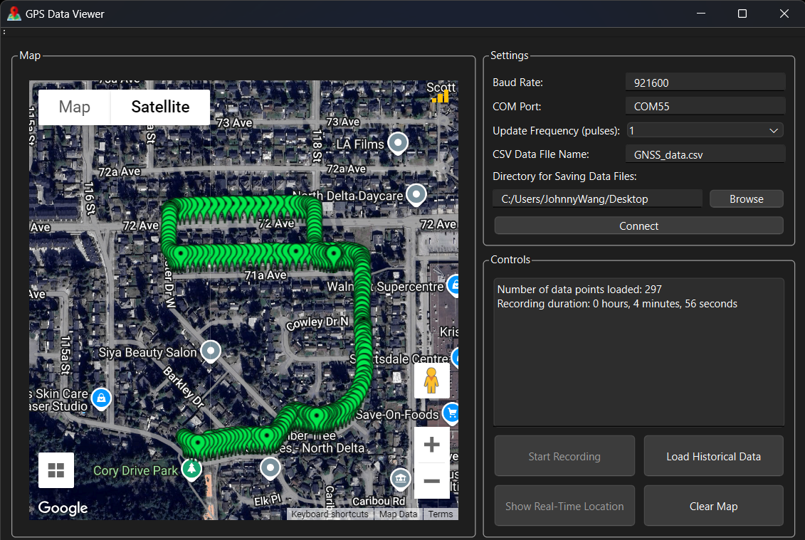

# GPS Viewer Application

This GNSS Desktop Application is a tool for viewing real-time and historical GPS data on a Google Maps interface. It allows users to connect to a GNSS device via a serial port, visualize real-time location data, load historical GPS data from CSV files, and manage data display on the map.

## Application Preview

## Live Demonstration

Watch the following video to see how the application works in real-time:

  
*Click to watch the video.*

## Features

- **Real-Time GPS Data Visualization**: Connect to a GNSS device using a serial port and visualize real-time location updates on a Google Map.
- **GPS Data Recording**: Record GPS data in real-time to a CSV file for future reference and analysis.
- **Historical Data Loading**: Load historical GPS data from CSV files and display them as permanent markers on the map.
- **Marker Customization**: Real-time and historical markers are displayed with color coding based on the signal-to-noise ratio (SNR) value.
- **Wi-Fi Signal Indicator**: Visual indicator of the Wi-Fi signal strength within the application.
- **Control Panel**: Includes options to start/stop recording, load historical data, toggle real-time location display, and refresh the map.
- **Input Validation and Safety Measures**: The application includes safeguards to prevent users from entering incorrect information that may cause the application to crash, enhancing stability and user experience.

## STM32 Firmware

The GNSS Desktop Application interfaces with a Quectel LC29H GNSS module via a serial port, and to handle this communication, firmware has been developed for an STM32 microcontroller. The STM32 acts as a transmitter, parsing and formatting each NMEA data pulse into one sentence for the desktop application to process. The firmware is available in the repository:

- [STM32 Firmware](https://github.com/johnnywang3739/GPS-desktop-app/tree/main/ST-firmware)

Make sure to upload the firmware to your STM32 board to ensure proper communication with the GNSS module.

## Code Structure

The application is composed of several key components, each defined in separate C++ files:

- **CSVUtils.cpp**: Provides utilities for handling CSV files, such as writing GNSS data to CSV and generating titles for map markers based on the data.
  
- **GNSS_desktop_application.cpp**: Contains the main application logic, including UI setup, serial port communication, real-time data processing, and interaction with the Google Maps interface.

- **GPSData.cpp**: Defines data structures and functions for parsing and handling GNSS sentences, converting coordinates, and verifying data integrity.

- **main.cpp**: The entry point of the application, which initializes and runs the Qt application.

- **NetworkUtils.cpp**: Handles network-related functionality, such as checking Wi-Fi signal strength and updating the Wi-Fi signal indicator on the map.

- **SerialPortUtils.cpp**: Manages serial port communication, reading data from the GNSS device, and processing it for display and recording.

## Installer Download

To install the GNSS Desktop Application on your computer, follow these steps:

1. Download the installer from the following link:
   - [GPS Viewer Installer](https://github.com/johnnywang3739/GPS-desktop-app/tree/main/installer/Output/)
   
2. Run the installer and follow the on-screen instructions to complete the installation.

3. Once installed, the application can be launched from your desktop or start menu.